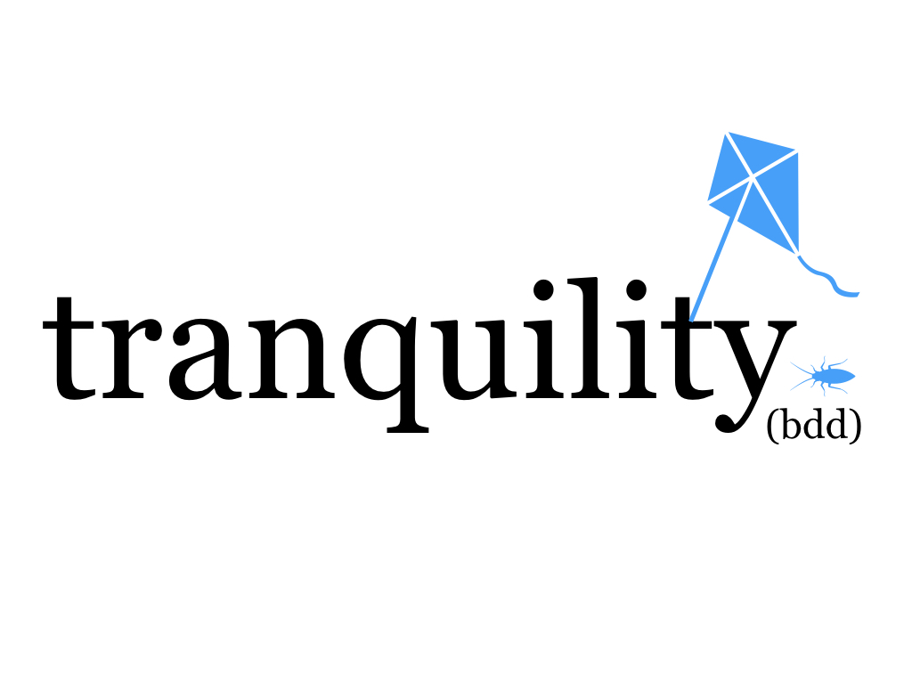

[](https://godoc.org/github.com/tranquility-bdd/tranquility)
[](https://opensource.org/licenses/MIT)
[](https://app.codacy.com/app/filfreire/tranquility-bdd?utm_source=github.com&utm_medium=referral&utm_content=tranquility-bdd/tranquility-bdd&utm_campaign=Badge_Grade_Dashboard)
[](https://circleci.com/gh/tranquility-bdd/tranquility)

a lightweight dependency/bloat-free alternative to serenity-rest-assured and serenity-core, a bit more maintainable than a regular Postman collection.

## The mission

- **Maintainable**: be more maintainable than postman - with little clutter - but equally as fast to develop full-length check suites as postman
- **Featherweight**: little dependencies (contrasting to serenity 170+ dependencies, or newmans 140+ dependencies)
- **Flexible**: do not lock the user to a "BDD" approach where user is forced to use Gherkin in order to use `tranquility`

## Requirements

Make sure you have [go](https://golang.org/) installed. Latest version we've tried on was `go1.12.7 darwin/amd64`


## How to use

Let's say you want to do an automated check for a `POST` http request.

This is what a `curl` of that request would look like:

```
curl --location \
    --header "Content-Type: application/json" \
    --header "Accept-Language: es-ES" \
    --request POST "https://postman-echo.com/post?status=active" \
    --data '{"title":"Finding Tranquility"}'
```

And you expect the http response status should be `200 OK` the response body should, among other data, include the `json` data you sent:
```
{"args":{"status":"active"},"data":{"title":"Finding Tranquility."},"files":{},"form":{},"headers":{"x-forwarded-proto":"https","host":"postman-echo.com","content-length":"32","accept-encoding":"gzip","accept-language":"es-ES","content-type":"application/json","user-agent":"Go-http-client/1.1","x-forwarded-port":"443"},"json":{"title":"Finding Tranquility."},"url":"https://postman-echo.com/post?status=active"}
```

In a new folder, create a file `example.go`, and in this file write, first import tranquility:
```
package main

import (
    "fmt"
    "github.com/tranquility-bdd/tranquility"
)
```

Then to define the above single `Request` where you'll code:
1) it's `PreAction`,
2) it's `Action`,
3) and it's `Test` phases,


A `PreAction` phase is where you define setup work (or the environment), which will influence the `Action` in runtime. A `PreAction` can be defined as a function anywhere on your code, as long as the function receives an action as argument, for example:
```
func examplesetup(action *tranquility.Action) {

    // You can initialize and do the setup for the environment (tranquility's "Env")
    tranquility.Env.Init(map[string]string{})
    //(...)

    // You can set http request headers:
    action.Headers = map[string]string{
        "Accept-Language": "{{.language}}",
        "Content-Type": "application/json"}

    // also http request parameters:
    action.Parameters = map[string]string{
        "status": "{{.status}}"}

    // and anywhere in the code, you can also later add of a new http parameter, or http header:
    //action.Parameters["status"] = "{{.status}}"
}

```

A `Test` phase, is basically a function where you can perform assertions (or any other work) on the `Action`'s `Response`:
```
func exampletest(res *tranquility.Response) {
    if res.StatusCode != 200 {
        panic(1)
    } else {
        fmt.Println("http status ✅")
        fmt.Println(res.Body)
    }
}
```

An `Action`phase is currently how you define how the http request will look like in runtime when executed:
```
var url = "https://{{.deployment}}-echo.com/post"
var body = "{\"title\":\"{{.title}}\"}"
var action = &tranquility.Action{Method: "POST", URL: url, Body: body}
```

There are other arguments that make up an action, like `Parameters` and `Headers` which you can define as well when defining the action, like what was done in the last line of the above snippet, or you can define them in the `PreAction`, it's optional.


A `Request` is where you wrap up the `PreAction`, `Action` and `Test`:
```

// defining the request:
request := &tranquility.Request{
    PreAction:examplesetup,
    Action:action,
    Test:exampletest}
```

To run the request call:
```
request.Run()
```

You can as well as setup your `Env` both inside the `PreAction`, or outside of it globally, which will influence the execution of the `Request` (when calling `yourRequest.Run()`);
```
tranquility.Env.Set("deployment", "postman")
tranquility.Env.Set("title", "Finding Tranquility.")
tranquility.Env.Set("status", "active")
tranquility.Env.Set("language", "es-ES")
```

All of the previous `Env` set key values mean that `tranquility` will take care for you of replacing any of the placeholders like `{{.deployment}}`, `{{.title}}`, `{{.language}}`, or any other key you define, in runtime, impacting the http request you are trying to run.

You can join up multiple `Request`'s using a `Collection`, and they'll run sequentially by calling `yourCollection.Run()`. For example:

```
yourCollection := tranquility.Collection{
    &tranquility.Request{PreAction: basicPreAction, Action: a, Test: simple200Test},
    (...)}
```

## More examples

You can check out a full example of Tranquility [soon](https://tranquility-bdd.com/) and another one that uses Cucumber [here](https://github.com/tranquility-bdd/tranquility-cucumber-example/).


## Feature roadmap
- *(MVP)* Users can code their actions and manipulate environment (which influences actions) ✅
- *(MVP)* Create example repository that uses MVP version of tranquility with `gucumber` ✅
- Users can use PreAction and Test template/abstractions as part of their tests, if they opt for a unit approach ✅
- Users can define "Lego piece" of the 3 main components - PreAction, Action and Test ✅
- Users can import Postman environment Json files to pre-fill `Env` with the config data ✅
- (Optional/Doubt/Nice-to-have) Be able to export Scenarios built with Lego pieces to JSONs that obey postman schema

## About the authors

`tranquility` was built as a pet project by [Jorge Martínez](https://www.linkedin.com/in/jmromanos/) and [Filipe Freire](https://www.linkedin.com/in/filfreire/).
Feel free to contribute with a Pull-request or a new issue, and reach out with questions and ideas.

## Usage
In case you area already using [Go modules](https://github.com/golang/go/wiki/Modules) you can just include `"github.com/tranquility-bdd/tranquility"` in your import statement.

Otherwise you can use the command `go get "github.com/tranquility-bdd/tranquility"` to download the package and then import it as before.
